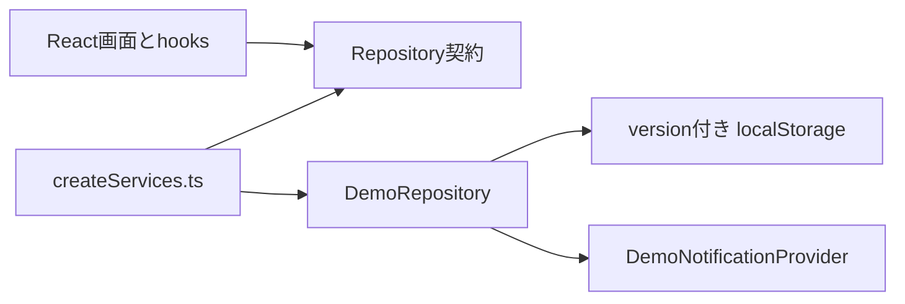

# フェーズA アーキテクチャ

## 依存方向



- 画面はRepository契約だけを利用する。
- `src/app/createServices.ts` だけが `VITE_APP_MODE` を判定する。
- デモアダプターだけが `localStorage` を参照する。
- Firebase、EmailJS、`/api`はフェーズAのバンドルから除外する。

## 主なデータ

- `experiences`: いちご、ブルーベリー、ハーブの体験情報
- `slots`: 日時、定員、料金、受付期間、公開状態（draft / published）、手動状態
- `bookings`: 予約番号、人数、料金スナップショット、状態
- `waitlistEntries`: 待機番号、人数、繰り上げ状態
- `notificationJobs`: 4種類の通知プレビューと送信状態
- `auditLogs`: 管理操作の履歴

## 個人情報の境界

フォーム入力値はReactの画面状態だけで扱います。Repositoryへ渡した後、永続化前に固定値へ置換します。通知と操作履歴にも入力値を含めません。

## 状態判定

表示状態は次の優先順位です。

```text
開催中止 → 生育調整中 → 受付停止 → 受付期間外 → 満員 → 残りわずか → 受付中
```

残席は、定員から `confirmed` 予約の大人・子ども・幼児をすべて引いて計算します。

## 開催枠の公開境界

- `PublicRepository`は`published`の開催枠だけを返し、下書きIDの直接参照も返しません。
- `BookingRepository`も保存直前に公開状態と受付状態を再確認します。
- キャンセル待ちは、満員または選択人数が残席を超える公開枠だけ受け付けます。
- `createSlots`は全件を検証してから一度だけ保存し、途中成功を発生させません。
- 予約・待機履歴がある開催枠の削除と、体験・日時・公開状態の変更はRepositoryで拒否します。

## デモ保存と復旧

保存形式はバージョン4です。旧バージョンの`localStorage`は読み込まず、現在月を基準にした初期データへ安全に戻します。「初期データへ戻す」でも同じ初期状態を再生成します。

## フェーズBでの差し替え

同じRepository契約を満たすproduction adapterを追加し、`createServices.ts`で差し替えます。画面からFirestoreへ直接アクセスさせず、利用者・管理者操作はVercel Functionsの `/api` だけを経由させます。
